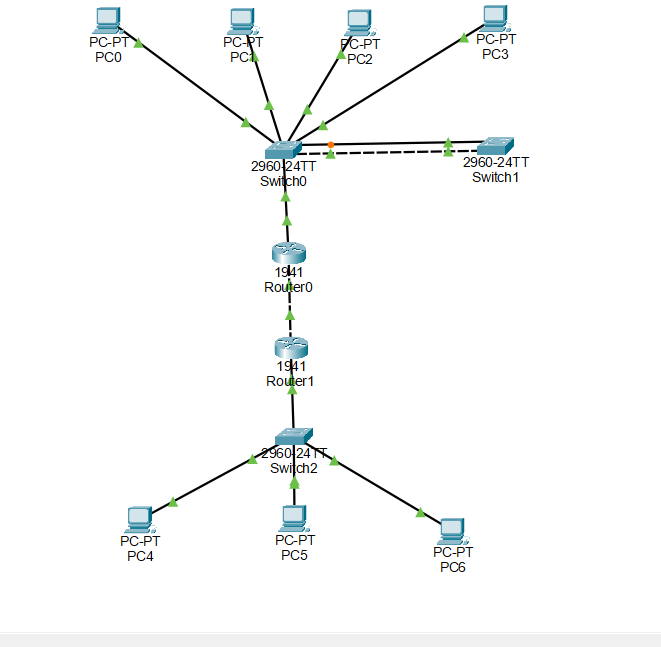
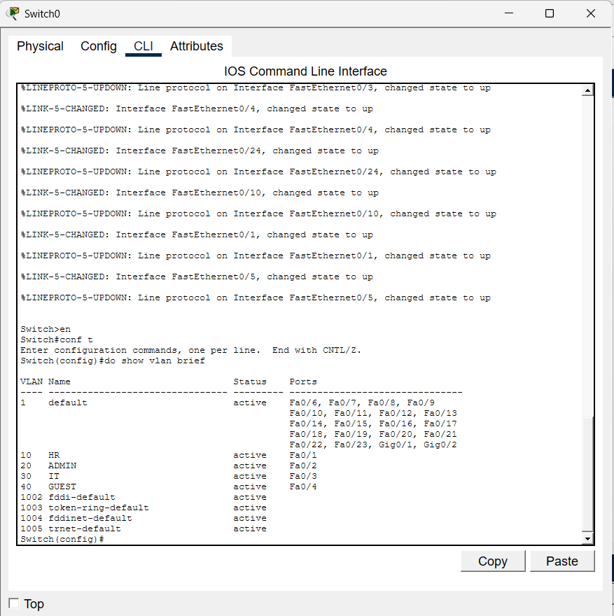
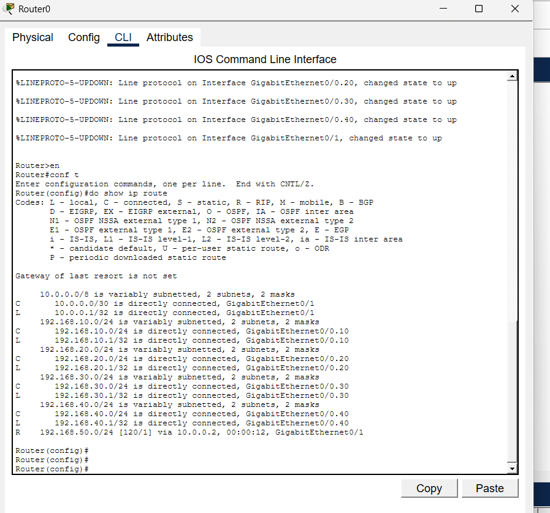
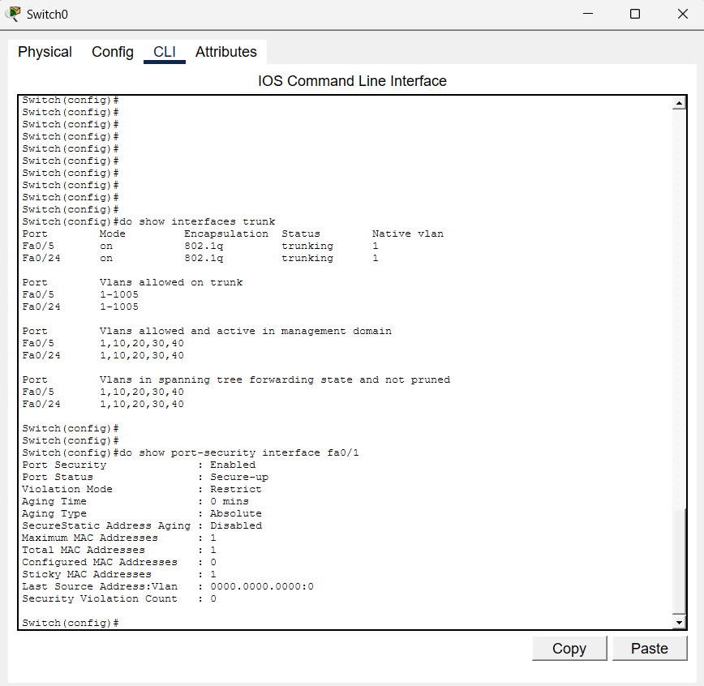

CCNA NETWORK PROJECT

Project Title:
Enterprise Network Design using VLAN, IPv4/IPv6, RIP and Port Security

Description:
This project demonstrates the design and implementation of a multi-network enterprise environment using Cisco Packet Tracer.

Technologies Used:
- VLAN (10, 20, 30, 40)
- Inter-VLAN Routing (Router on a Stick)
- IPv4 and IPv6 addressing
- RIP Routing Protocol
- Port Security (restrict mode)
- Trunking between switches and router

Network Features:
- Multiple departments separated using VLANs
- Secure access using port security
- Communication between VLANs using routing
- Branch to Head Office connectivity using RIP
- Dual stack configuration (IPv4 + IPv6)

Testing Performed:
- Successful ping between VLANs
- Branch network communication verified
- Port security tested with unauthorized device
- IPv6 connectivity tested

  ## Project Screenshots

### Network Topology

### VLAN Configuration

### Routing Table

### Port Security

### IPv4 Ping Test

### IPv6 Ping Test

Outcome:
The network successfully ensures secure and efficient communication across multiple segments.

Author:
Vaishnavi
